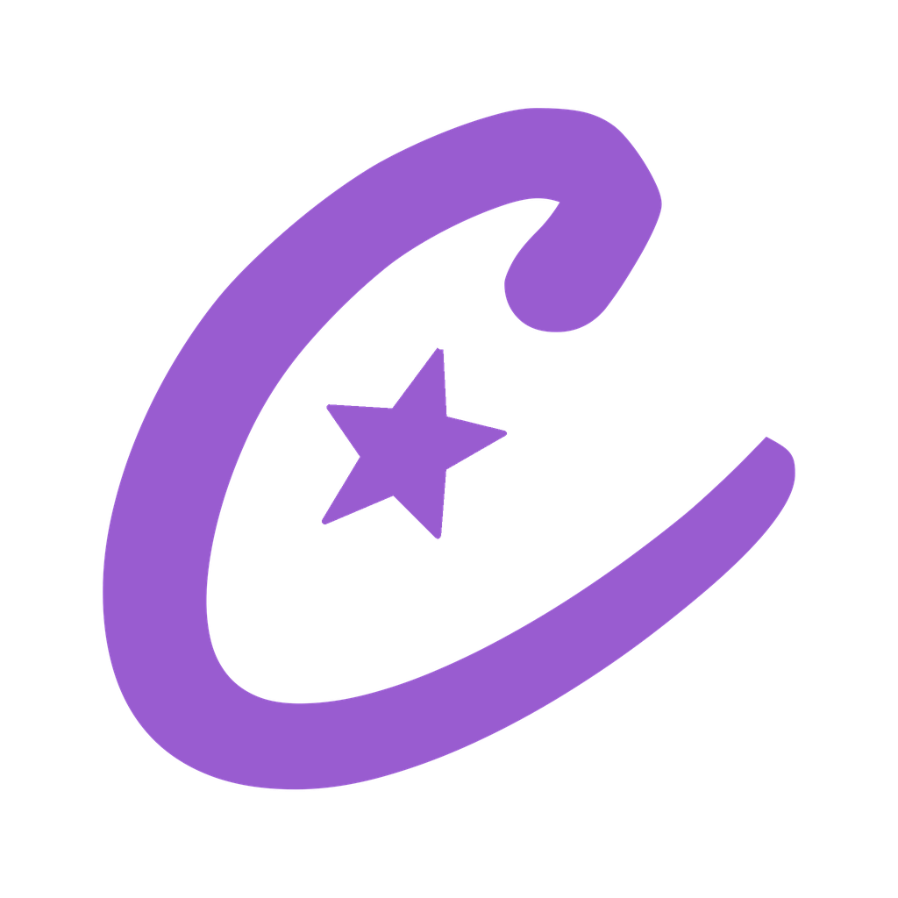

### Hola, soy César 👋

Soy desarrollador de software de Cali, Colombia. Disfruto de participar en proyectos, programo para mi trabajo y como hobby también siempre mantengo creando cosas nuevas, cosas locas o ambiciosas, siempre con el interés de algo nuevo que aprender y mejorar.

### Contacto

  <!-- Cuando me pases tus iconos propios, solo reemplaza el src por ./assets/linkedin.png, ./assets/gmail.png, etc. -->
  
  &nbsp;
  <a href="https://carv-portfolio.netlify.app/">
    <!-- Guarda la imagen morada (C con estrella) que me compartiste como assets/portfolio.png -->
    
  </a>
  &nbsp;
  

